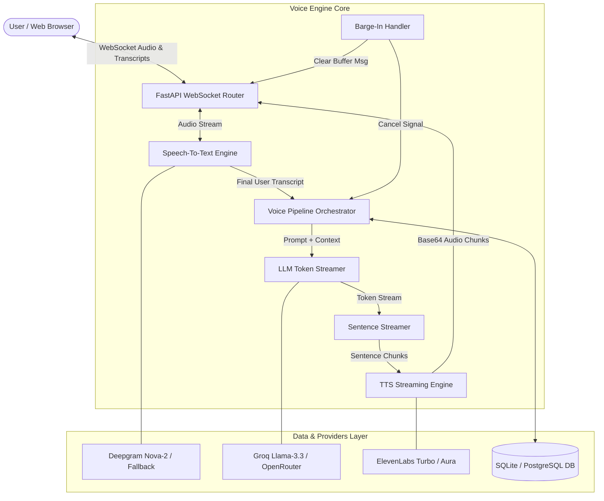
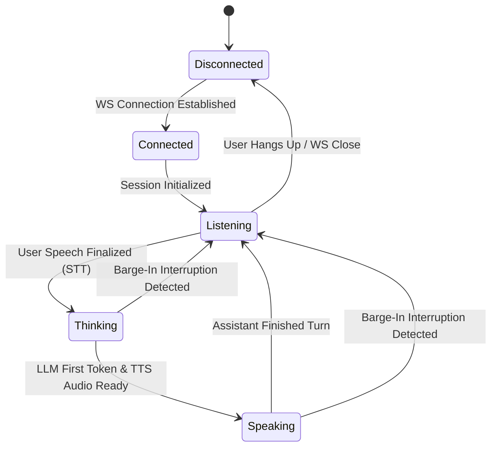

# VoxAI — System Architecture & Data Flow

This document details the high-level architecture, end-to-end data flow, connection protocols, and session lifecycle of **VoxAI**.

---

## 1. High-Level Architecture Diagram



---

## 2. End-to-End Core Data Flow

```text
  [ USER ]                [ FRONTEND ]             [ FASTAPI BACKEND ]         [ PROVIDER (STT/LLM/TTS) ]
     |                         |                           |                               |
     |---- Speaks into Mic --->|                           |                               |
     |                         |-- STT WebSockets/Audio -->|                               |
     |                         |                           |--- Stream Audio Chunk ------->| (Deepgram STT)
     |                         |                           |<-- Real-time Transcript ------|
     |                         |<-- Live User Transcript --|                               |
     |                         |                           |                               |
     |                         |                           |--- Stream Messages ----------->| (Groq / OpenRouter LLM)
     |                         |                           |<-- Token Stream --------------|
     |                         |                           |                               |
     |                         |                           |-- Sentence Chunk to TTS ------>| (ElevenLabs / Aura TTS)
     |                         |                           |<-- Audio Byte Stream ---------|
     |                         |<-- Base64 Audio Chunks ---|                               |
     |<--- Audio Plays --------|                           |                               |
     |                         |                           |                               |
     |==== BARGE-IN EVENT =====|                           |                               |
     |---- Interrupts / Speaks ->|                          |                               |
     |                         |-- Signal "barge_in" ----->|                               |
     |                         |                           |-- Cancel Active Token --------| (Atomic Cancellation)
     |                         |<-- Flush Audio Command ---|                               |
     |<--- Stop Playback ------|                           |                               |
```

---

## 3. Communication Protocols

### 3.1 REST API (`/api/v1`)
Used for asynchronous, non-real-time dashboard control operations:
- `/api/assistants`: Assistant configuration CRUD operations.
- `/api/calls`: Call transcript logs, latency waterfall reports, and usage metrics.
- `/api/health`: System status, provider API health checks.

### 3.2 WebSockets (`ws://<host>:<port>/ws/call/{session_id}`)
Used for full-duplex real-time audio and status streaming:
- **Client to Server**:
  - `config`: Update active assistant, voice, system prompt, or provider keys dynamically.
  - `user_text`: WebSpeech or client-recognized user transcript.
  - `audio_chunk`: Raw PCM/WebM audio bytes from client microphone.
  - `barge_in`: Explicit interruption event triggered by client VAD or speech detection.
- **Server to Client**:
  - `connection_established`: Initial handshake confirmation.
  - `status`: State transitions (`listening`, `thinking`, `speaking`, `idle`).
  - `user_transcript`: Echoed final user speech transcript.
  - `assistant_text_chunk`: Real-time streaming text of the assistant's response.
  - `audio_chunk`: Base64-encoded TTS audio frames for immediate web playback.
  - `barge_in`: Command instructing client audio player to immediately halt playback and flush pending queue.
  - `turn_completed`: Full turn text summary and breakdown latency metrics.

---

## 4. Voice Call Session Lifecycle State Machine



---

## 5. Security & Multi-Provider Isolation

1. **Provider Isolation**: All STT, LLM, and TTS providers implement abstract interface classes (`BaseSTTProvider`, `BaseLLMProvider`, `BaseTTSProvider`).
2. **API Key Management**: System defaults can be overridden per assistant or per session without modifying server environment variables.
3. **Graceful Fallbacks**: If a primary provider experiences rate limits or timeouts, fallback providers are automatically engaged to maintain session continuity.
