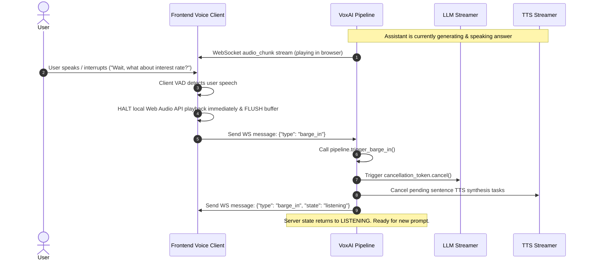

# VoxAI — Barge-In Interruption & Latency Optimization Specification

Barge-in interruption handling and sub-800ms response latency are the defining operational requirements of **VoxAI**. This document details the technical mechanisms, state synchronization, audio buffer flushing, and latency calculation metrics.

---

## 1. Barge-In Interruption Architecture

In human speech, when one speaker interrupts, the other immediately stops talking, flushes queued thoughts, and begins listening. VoxAI replicates this exact behavior through an **Atomic Cancellation & Buffer Flush** pattern.



---

## 2. Cancellation Token & Task Management

VoxAI utilizes an atomic `CancellationToken` object passed to all async generators (LLM token stream, Sentence Streamer, TTS audio stream).

```python
class CancellationToken:
    def __init__(self):
        self._cancelled = False

    def cancel(self):
        self._cancelled = True

    def is_cancelled(self) -> bool:
        return self._cancelled
```

### Server Cancellation Steps on Interruption:
1. `cancellation_token.cancel()` is called.
2. Async loops checking `cancel_token.is_cancelled()` terminate instantly.
3. Active `asyncio.Task` running `_execute_assistant_turn` is cancelled (`task.cancel()`).
4. Pipeline state `is_speaking` resets to `False`.
5. WebSocket status set to `"listening"`.

---

## 3. Client-Side Audio Buffer Management

To prevent stale audio from playing after an interruption:
1. The frontend maintains an HTML5 Web Audio API `AudioBufferSourceNode` queue or Audio element queue.
2. Upon VAD speech detection or receiving a server `"barge_in"` message:
   - Call `source.stop()` on currently playing audio source.
   - Clear the audio chunk queue array (`audioQueue = []`).
   - Reset current audio playback state to `IDLE`.

---

## 4. Latency Breakdown & Waterfall Tracking

VoxAI logs precise timestamps across every phase of a conversation turn to quantify end-to-end (E2E) response latency.

### 4.1 Measured Timestamps

| Metric Key | Description | Target Threshold |
| :--- | :--- | :--- |
| $t_{\text{user\_eos}}$ | Timestamp when user finished speaking | 0 ms (baseline) |
| $t_{\text{stt\_final}}$ | Timestamp when final STT text transcript is confirmed | $< 150 \text{ ms}$ |
| $t_{\text{llm\_first\_token}}$ | Timestamp when first LLM response token is received | $< 250 \text{ ms}$ |
| $t_{\text{tts\_first\_audio}}$ | Timestamp when first audio byte chunk arrives from TTS | $< 350 \text{ ms}$ |
| $t_{\text{total\_e2e}}$ | Total delay before user hears assistant audio | $< 750 \text{ ms}$ |

### 4.2 Latency Calculation Formulas

$$\text{STT Latency} = t_{\text{stt\_final}} - t_{\text{user\_eos}}$$

$$\text{LLM Time to First Token (TTFT)} = t_{\text{llm\_first\_token}} - t_{\text{stt\_final}}$$

$$\text{TTS First Audio Latency} = t_{\text{tts\_first\_audio}} - t_{\text{llm\_first\_token}}$$

$$\text{Total E2E Latency} = t_{\text{tts\_first\_audio}} - t_{\text{user\_eos}}$$

---

## 5. Sub-800ms Optimization Strategies

1. **Groq Llama-3 70B / Qwen 27B**: Ultra-high inference throughput (> 300 tokens/sec) yields TTFT < 150ms.
2. **Deepgram Nova-2 Streaming**: WebSocket STT with interim results and automatic end-of-speech detection.
3. **Sentence Chunking**: Synthesizing audio per sentence rather than waiting for entire paragraph responses reduces voice generation delay by over 70%.
4. **WebSocket Compression & Binary Encoding**: Using optimized base64 or direct binary audio frame streaming eliminates HTTP request overhead.
