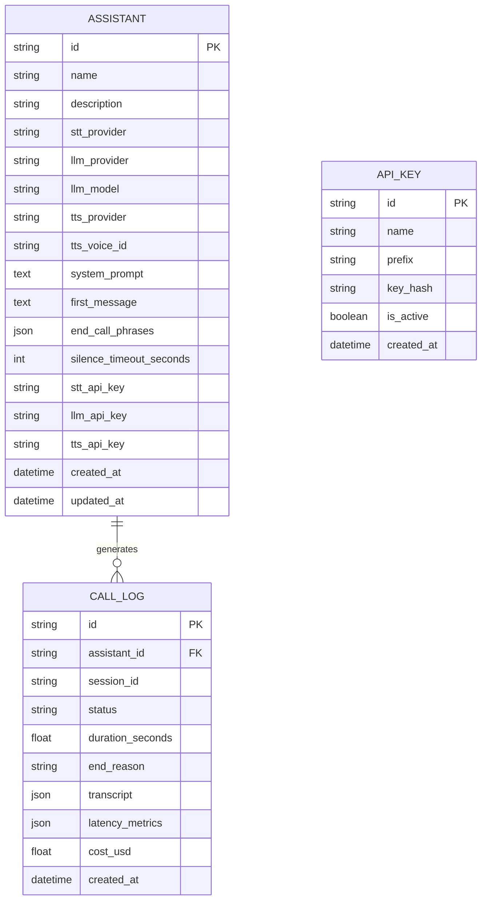

# VoxAI — API & Database Specification

This document details the database models, REST API endpoints, Pydantic schemas, and provider factory abstractions powering the **VoxAI** platform.

---

## 1. Database Entity Relationship Model



---

## 2. REST API Endpoints Specification

### 2.1 Assistants Management (`/api/v1/assistants`)

#### `GET /api/v1/assistants`
Retrieve a list of all configured voice assistants.
- **Response**: `200 OK` → `List[AssistantRead]`

#### `POST /api/v1/assistants`
Create a new voice assistant configuration.
- **Request Body**: `AssistantCreate`
```json
{
  "name": "Bank Loan Assistant",
  "description": "Helps customers evaluate personal loan options.",
  "stt_provider": "deepgram",
  "llm_provider": "groq",
  "llm_model": "llama-3.3-70b-versatile",
  "tts_provider": "elevenlabs",
  "tts_voice_id": "JBFqnCBsd6RMkjVDRZzb",
  "system_prompt": "You are a friendly bank customer support assistant for VoxBank...",
  "first_message": "Hello! I can assist you with personal loan details today."
}
```
- **Response**: `201 Created` → `AssistantRead`

#### `GET /api/v1/assistants/{id}`
Get detailed configuration of a specific assistant.

#### `PUT /api/v1/assistants/{id}`
Update an assistant's configuration or provider parameters.

#### `DELETE /api/v1/assistants/{id}`
Delete an assistant and associated logs.

---

### 2.2 Call Logs & Analytics (`/api/v1/calls`)

#### `GET /api/v1/calls`
Retrieve call history with pagination and assistant filtering.
- **Query Params**: `limit` (default 50), `offset` (default 0), `assistant_id` (optional).
- **Response**: `200 OK` → `List[CallLogRead]`

#### `GET /api/v1/calls/{session_id}`
Retrieve complete call transcript, timing metrics, and performance analytics for a single call session.

#### `POST /api/v1/calls`
Log a completed call session (called by WebSocket voice engine upon session disconnect).

---

### 2.3 System & Health (`/api/v1/health`)

#### `GET /api/v1/health`
Check application health and status of external provider integrations.
- **Response**:
```json
{
  "status": "healthy",
  "version": "0.1.0",
  "providers": {
    "groq": "available",
    "openrouter": "available",
    "deepgram": "available",
    "elevenlabs": "available"
  }
}
```

---

## 3. Provider Factory Architecture

The `ProviderFactory` class decouples the application from concrete provider SDKs:

```python
class ProviderFactory:
    @staticmethod
    def get_stt_provider(provider_name: str, api_key: Optional[str] = None) -> BaseSTTProvider: ...
    
    @staticmethod
    def get_llm_provider(provider_name: str, model: Optional[str] = None, api_key: Optional[str] = None) -> BaseLLMProvider: ...
    
    @staticmethod
    def get_tts_provider(provider_name: str, voice_id: Optional[str] = None, api_key: Optional[str] = None) -> BaseTTSProvider: ...
```

### Supported Providers:
- **STT**: `DeepgramSTTProvider`, `FallbackSTTProvider` (WebSpeech / mock).
- **LLM**: `GroqLLMProvider` (Llama-3.3, Qwen), `OpenRouterLLMProvider` (Claude 3.5, GPT-4o-mini).
- **TTS**: `ElevenLabsTTSProvider` (Turbo v2.5), `DeepgramAuraTTSProvider` (Aura Asteria), `FallbackTTSProvider` (gTTS/browser synth).
