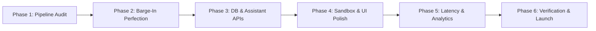

# VoxAI — Comprehensive Phase-by-Phase Roadmap

This document outlines the master implementation plan for building, testing, verifying, and launching **VoxAI**.

---

## 📊 Current Project Audit & Baseline

| Module | Current Status | Key Required Tasks |
| :--- | :--- | :--- |
| **Backend Core** | 80% Complete | Verify FastAPI async startup, route schemas, DB session initialization. |
| **Voice Pipeline** | 85% Complete | Test token streamer, sentence segmenter, base64 audio chunking over WebSockets. |
| **Barge-In System** | 75% Complete | Ensure atomic token cancellation and immediate client audio buffer flush. |
| **Providers Abstraction** | 85% Complete | Verify Groq, OpenRouter, Deepgram, ElevenLabs, and fallback speech synthesis handlers. |
| **REST APIs & Database** | 70% Complete | Complete CallLog session updates, transcript array saving, cost tracking. |
| **Frontend Sandbox** | 80% Complete | Polish dark theme UI, refine audio waveform canvas, add latency waterfall chart. |

---

## 🚀 Execution Phases

---

### Phase 1: Voice Engine & Streaming Pipeline Verification
**Goal**: Verify low-latency real-time voice streaming from user input to LLM token generator to TTS chunking.

- **Tasks**:
  1. Test WebSocket connection endpoint `/ws/call/{session_id}`.
  2. Validate `SentenceStreamer` regex delimiter regex for smooth phrase chunking.
  3. Ensure base64 audio payload transmission over WebSocket.
- **Verification**: Run backend test client or pytest to measure TTFT and first audio chunk emission under 600ms.

---

### Phase 2: Instant Barge-In & Audio Buffer Flush Perfection
**Goal**: Ensure 100% reliable interruption handling when the user speaks or clicks interrupt while the AI is talking.

- **Tasks**:
  1. Verify `CancellationToken` propagates cancellation immediately to LLM stream and TTS tasks.
  2. Implement client Web Audio API `stop()` and `audioQueue = []` flushing logic upon receiving `"barge_in"` signal.
  3. Test rapid consecutive user interruptions.
- **Verification**: Simulate client barge-in during AI turn execution and verify generation stops immediately without audio overlapping.

---

### Phase 3: Assistant CRUD & Provider API Integration
**Goal**: Enable dynamic creation, editing, prompt configuration, and provider key overrides per voice assistant.

- **Tasks**:
  1. Complete REST routes `/api/v1/assistants` (GET, POST, PUT, DELETE).
  2. Connect provider factory settings to dynamic assistant models (Groq/OpenRouter, Deepgram, ElevenLabs/Aura).
  3. Test system prompt and custom voice ID injection into active sessions.
- **Verification**: Create a new assistant via API/UI, start call, and verify it uses the customized system prompt and voice ID.

---

### Phase 4: Frontend UI, Voice Call Sandbox & Waveform Polish
**Goal**: Deliver a premium, dark-mode user interface with real-time audio visualization and streaming transcript updates.

- **Tasks**:
  1. Refine `AudioVisualizer.tsx` canvas rendering for dynamic frequency pulse animations.
  2. Upgrade `page.tsx` multi-tab interface (Sandbox, Assistants, Call Logs, Settings).
  3. Integrate live transcript viewer and instant barge-in control button.
- **Verification**: Test voice call session in browser sandbox; ensure waveform pulses dynamically and transcript updates live.

---

### Phase 5: Latency Waterfall Analytics & Call Log Persistence
**Goal**: Capture precision timing metrics for every turn and persist completed call sessions into SQLite/PostgreSQL database.

- **Tasks**:
  1. Complete `LatencyTracker` timestamp logging ($t_{\text{user\_eos}}$, $t_{\text{stt\_final}}$, $t_{\text{llm\_first\_token}}$, $t_{\text{tts\_first\_audio}}$).
  2. Persist turn metrics and full transcript JSON to `CallLog` model on session disconnect.
  3. Build `LatencyWaterfall.tsx` UI component in frontend call history drawer.
- **Verification**: Conduct a test call, hang up, inspect DB record, and verify waterfall chart displays latency breakdown.

---

### Phase 6: Telephony Integration & Full System End-to-End Verification
**Goal**: Validate full system reliability, test fallback providers, and prepare production build.

- **Tasks**:
  1. Test Twilio audio stream handler (`backend/app/voice/twilio.py`) converting 8kHz G.711 $\mu$-law to 16kHz PCM.
  2. Verify graceful provider fallbacks when API keys are missing or invalid.
  3. Run frontend production build (`npm run build`) and backend schema validation.
- **Verification**: Run end-to-end verification test suite and confirm zero critical console errors or unhandled exceptions.
